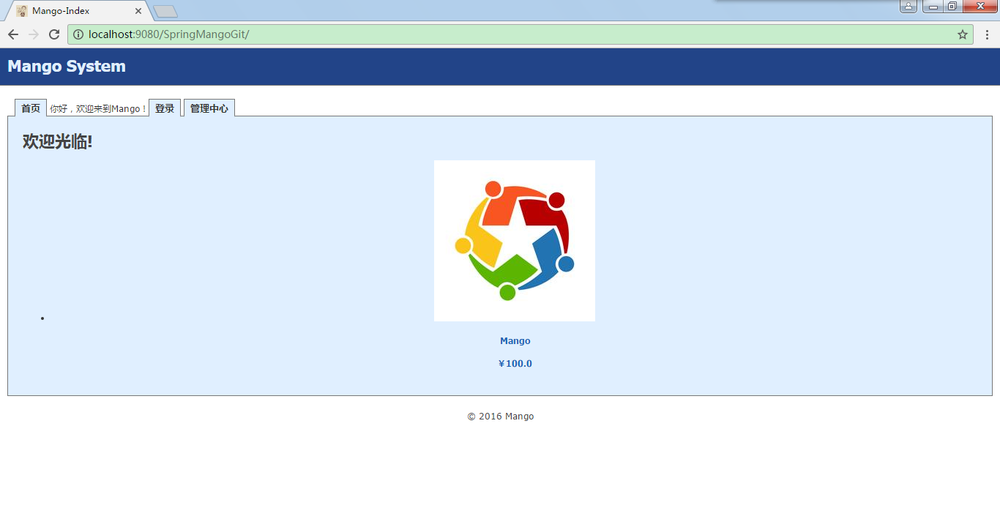

# GradleSpringMVCMango
Spring实战系列代码（基于Gradle构建），参考http://blog.csdn.net/honghailiang888/article/details/53113853
CSDN知识库图谱位置http://lib.csdn.net/my/chart/Spring4.3.2%E5%AE%9E%E6%88%98

环境配置要求：
jdk8，tomcat8

采用hsqldb存储数据，自动建表并初始化普通用户（用户名：mango，密码123456（md5加密后存入库）），
管理员用户（用户名：manager，密码123456）